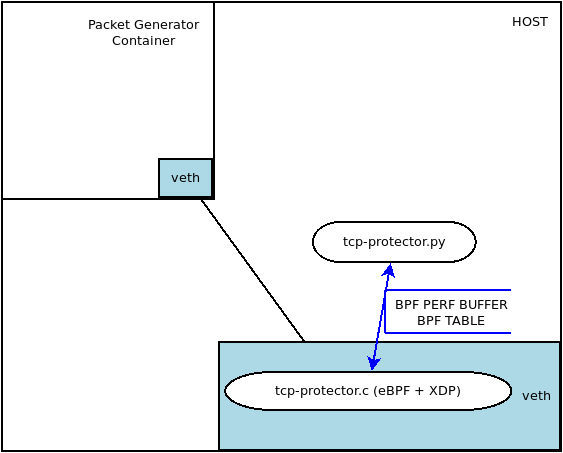

# tcp-protector

**tcp-protector** seçilen bir ağ arabirimine XDP vasıtasıyla eklenir ve eBPF ile ağ trafiğini inceler. Ağ trafiği içinde üç farklı saldırıyı tesptit eder:
- **SYN FLOOD**
- **Data on SYN** 
- **SYN ve FIN bayrakları set edilmiş paketler**

Çalışma mantığı aşağıdaki görselde görülebilir:





## Test Ortamının Hazırlanması
Bu proje Ubuntu 18.04 üzerinde denenmiştir. Aşağıdaki komut adımları test ortamını hazır hale getirecektir.

```bash
git clone https://github.com/alptugay/tcp-protector.git
sudo apt install clang llvm libelf-dev libpcap-dev gcc-multilib build-essential
sudo apt install linux-tools-$(uname -r)
sudo apt-get -y install bison build-essential cmake flex git libedit-dev libllvm6.0 llvm-6.0-dev libclang-6.0-dev python zlib1g-dev libelf-dev libfl-dev hping3
git clone https://github.com/iovisor/bcc.git
mkdir bcc/build; cd bcc/build
cmake ..
make
sudo make install
cmake -DPYTHON_CMD=python3 .. # build python3 binding
pushd src/python/
make
sudo make install
popd
```

## Test Adımları


- Bu komut ile içinde virtual bir interface olan network namespace yaratılır.
```bash
sudo ../../tcp-protector/testenv/testenv.sh setup --name veth03 --legacy-ip
```
- Bu komut ile synflood, data on syn, syn ve fin set paketlerini engelleyen xdp/ebpf servisi çalıştırılır.
```bash
cd ../../tcp-protector/
sudo ./tcp-protector.py veth03
```
- Bu komut ile namespace içinde oluşan virtual interface'in IP adresine bakılır
```bash
sudo ip netns exec veth03 ifconfig veth0 | egrep 'inet ' | awk '{print $2}'
```
- Bu komut ile host sistem içinde oluşan virtual interface'in IP adresi HOSTIP değişkenine atanır.
```bash
HOSTIP=$(ifconfig veth03 | egrep 'inet ' | awk '{print $2}')
```
- Bu komut ile syn paketlerinin düzgün bir şekilde iletildiği test edilmiş olur
```bash
sudo ip netns exec veth03 hping3 $HOSTIP -p 8000 -S
```
- Bu komut ile hem syn hem fin bayrağı set edilmiş paketler atılır. İlk paket geçtikten sonra bu IP adresinden gelen diğer paketlerin 5 saniye boyunca engellendiği görülür.
```bash
sudo ip netns exec veth03 hping3 $HOSTIP -p 8000 -S -F
```
- Bu komut ile syn bayrağı set edilmiş paket üzerinde tcp payload olan paketler atılır. İlk paket geçtikten sonra bu IP adresinden gelen diğer paketlerin 3 saniye boyunca engellendiği görülür.
```bash
sudo ip netns exec veth03 hping3 $HOSTIP -p 8000 -S -d 5
```
- Bu komut ile syn flood saldırısı gerçekleştirilir. İlk paket geçtikten sonra bu IP adresinden gelen diğer paketlerin 10 saniye boyunca engellendiği görülür
```bash
sudo ip netns exec veth03 hping3 $HOSTIP -p 8000 -S --faster
```
- Bu komut ile daha yavaş (10 pps) syn flood saldırısı gerçekleştirilir. Syn Flood thresholdu 25 pps olduğu için bu IP den gelen paketler engellenmez.
```bash
sudo ip netns exec veth03 hping3 $HOSTIP -p 8000 -S --fast
```


